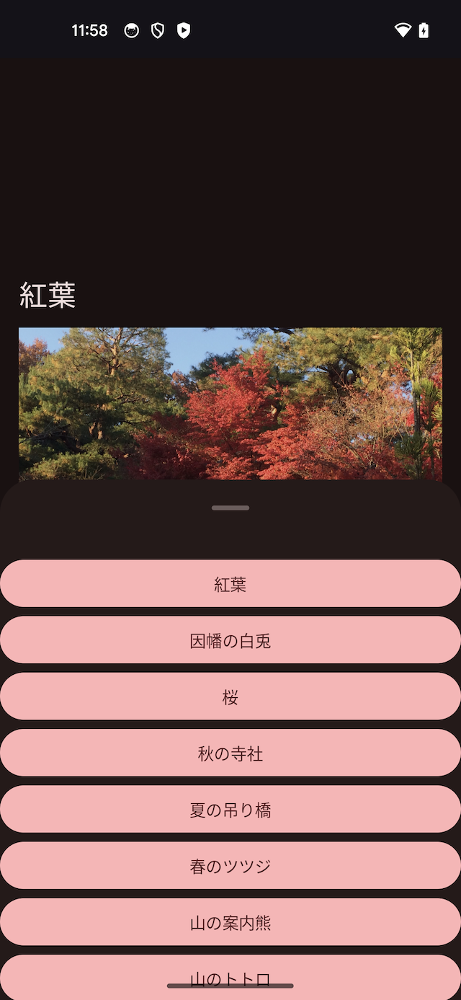

# ComposeImpl

## このアプリについて

- 自身がAndroidX Jetpack Compose の機能を理解する目的で作成したAndroidプロジェクトです
- `Activity` ごとに違う目的のもとにコンポーザブルを試しています。具体的には以下の通りです
  1. `ConstraintLayout` を使ったレイアウトの確認
  2. `ConstraintLayout` を使って、1とは異なるレイアウトの確認
  3. `Image` の `contentScale` 次第で画像がどのように表示されるかの検証と、 `BottomSheetScaffold` を使って Bottom sheets の実装を確認
  4. `Fragment` でのレイアウト方法の確認と、 `SegmentedButton` を使って Segmented buttons の実装確認
  5. `ModalBottomSheet` を使って Bottom sheets の実装確認
  6. `HorizontalPager` を使って、ページャーの基本的な実装を確認
  7. `Scaffold` を使って、上下のアプリバーとFABの基本的な実装と Snackbar の使用方法を確認
- 有用な機能を備えている訳ではありませんので、Google Play等で公開する予定もありません（当然ですが）

## スクリーンショット

- 端末はPixel5、OSバージョンはAndroid14です
- 全てダークモードで撮影しています

| ConstraintLayout(1) | ConstraintLayout(2) | Image.contentScale | Fragment |
|:---:|:---:|:---:|:---:|
|  |  |  |  |

| ModalBottomSheet | HorizontalPager | Scaffold + App bars + FAB |
|:---:|:---:|:---:|
|  |  |  |
